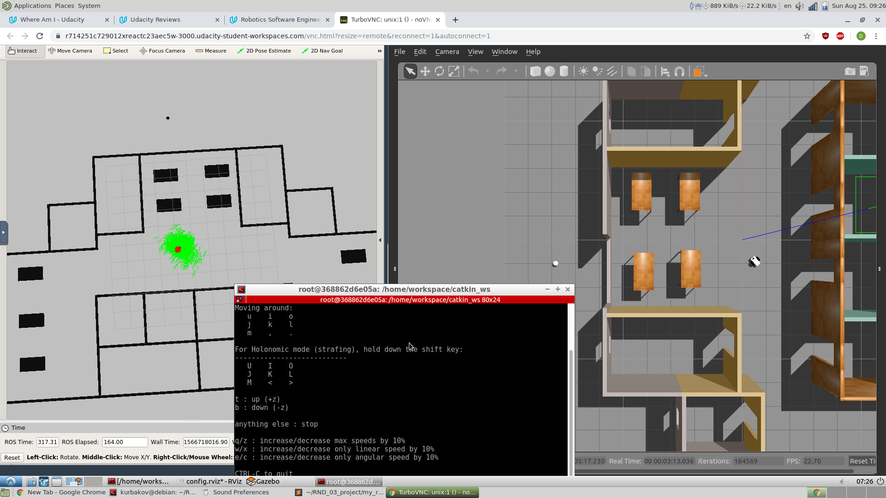

# Project description

<p align="center">
  
</p>

Install dependencies:
```
sudo apt-get install ros-kinetic-navigation
sudo apt-get install ros-kinetic-map-server
sudo apt-get install ros-kinetic-move-base
sudo apt-get install ros-kinetic-amcl
```

To run the simulation:
```
cd ~
git clone https://github.com/kurbakov/RND_03_project.git
mkdir -p catkin_ws/src

ln -s RND_03_project/my_robot ./catkin_ws/src/my_robot
ln -s RND_03_project/teleop_twist_keyboard ./catkin_ws/src/teleop_twist_keyboard
ln -s RND_03_project/run_all.launch ./catkin_ws/ln -s RND_03_project/

cd catkin_ws/src && catkin_init_workspace
cd .. && catkin_make
source devel/setup.bash
roslaunch run_all.launch
```

To control the robot in the simulation run ths in new terminal:
```
cd ~/catkin_ws/ && source devel/setup.bash
rosrun teleop_twist_keyboard teleop_twist_keyboard.py
```

    .RND_03_project
    ├── my_robot      
    |   ├── config
    │   │   ├── base_local_planner_params.yaml
    │   │   ├── costmap_common_params.yaml
    │   │   ├── global_costmap_params.yaml
    │   │   ├── local_costmap_params.yaml
    │   ├── launch   
    │   │   ├── robot_description.launch
    │   │   ├── world.launch
    |   |   ├── amcl.launch
    |   ├── maps
    │   │   ├── map.pgm
    │   │   ├── map.yaml
    │   ├── meshes
    │   │   ├── hokuyo.dae
    │   ├── rviz
    │   │   ├── rviz.config
    │   ├── urdf
    │   │   ├── my_robot.gazebo
    │   │   ├── my_robot.xacro
    │   ├── world
    │   │   ├── MyWorld.world
    │   ├── CMakeLists.txt
    │   ├── package.xml
    ├── teleop_twist_keyboard                   
    │   ├── ... (this is the clone of the package teleop_twist_keyboard)
    ├── images
    │   ├── RobotLocalization.png
    ├── README.md
    ├── run_all.launch
